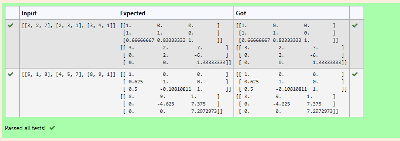
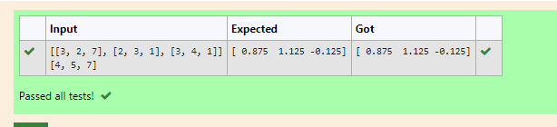

# LU Decomposition without zero on the diagonal

## AIM:
To write a program to find the LU Decomposition of a matrix.

## Equipments Required:
1. Hardware – PCs
2. Anaconda – Python 3.7 Installation / Moodle-Code Runner

## Algorithm
1. import numpy as np
2. from scipy.linalg import lu
3. declare the matrix to a variable A
4. declare P,L,U to A
5. print L and U of a matrix

## program
```
Program to find L and U matrix using LU decomposition.
Developed by:Haridharshini.S 
RegisterNumber:21500176 

import numpy as np
from scipy.linalg import lu
A=np.array(eval(input()))
P,L,U=lu(A)
print(L)
print(U)
```


## Output:



## Result:
Thus the program to find the LU Decomposition of a matrix is written and verified using python programming.

# LU Decomposition to solve a matrix
## AIM:
To write a program to find the LU Decomposition of a matrix.

## Equipments Required:
1. Hardware – PCs
2. Anaconda – Python 3.7 Installation / Moodle-Code Runner

## Algorithm
1. import numpy as np
2. from scipy.linalg import lu_factor,lu_solve
3. assign values of A and B
4. declare lu_pivot to lu_factor of A
5. assign x to lu_solve of lu_factor A
6. print(x)

## program
```
Program to solve a matrix using LU decomposition.
Developed by:Haridharshini.S 
RegisterNumber:21500176

import numpy as np
from scipy.linalg import lu_factor, lu_solve
A=np.array(eval(input()))
B=np.array(eval(input()))
lu, pivot = lu_factor(A)
X=lu_solve((lu,pivot),B)
print(X)
```

## Output:



## Result:
Thus the program to find the LU Decomposition of a matrix is written and verified using python programming.